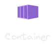

::: {.justify}
# Introduccion a Docker

::: {.center}
{width=200px}
:::

Docker es una plataforma que permite desarrollar, enviar y ejecutar aplicaciones en contenedores. Un **contenedor** es una instancia ejecutable de una **imagen**, que es una plantilla que contiene todo lo necesario para ejecutar una aplicacion.

Haciendo una analogia con los contenedores de transporte, una **imagen** es el **plano/plantilla** (lo que se puede replicar), y el **contenedor** es la **instancia en ejecucion** (lo que efectivamente se "mueve" y corre).

Docker resuelve un problema principal en el desarrollo de software: la **portabilidad**. Al empaquetar una aplicacion y sus dependencias en un contenedor, se garantiza que la aplicacion se ejecute de manera **consistente** en diferentes entornos.

Con Docker se acaba la frase tipica de los desarrolladores **"En mi maquina funciona"**. Con Docker, puedes estar seguro de que tu aplicacion funcionara de la misma manera en cualquier entorno.

## Docker vs Maquinas Virtuales

| Aspecto | Docker (Contenedores) | Maquinas Virtuales |
|---------|----------------------|-------------------|
| **Aislamiento** | Aislamiento a nivel de proceso | Aislamiento a nivel de hardware |
| **Sistema operativo** | Comparten el SO del host | Cada VM tiene su propio SO |
| **Tamanio** | Ligeros (MB) | Pesados (GB) |
| **Arranque** | Segundos | Minutos |
| **Rendimiento** | Casi nativo | Sobrecarga por hipervisor |
| **Uso de recursos** | Eficiente | Mayor consumo de RAM/CPU |
| **Portabilidad** | Altamente portable | Dependiente del hipervisor |

::: {.callout-note}
Los contenedores son ideales para microservicios y desarrollo local. Las VMs siguen siendo utiles para aislar completamente diferentes sistemas operativos o cuando se necesita un kernel separado.
:::

## Imagenes y Contenedores

::: {.center}

:::

Una imagen Docker es una **plantilla inmutable** que contiene un conjunto de instrucciones para crear un contenedor Docker. Las imagenes son portatiles y pueden ser compartidas, almacenadas y actualizadas.

::: {.callout-tip}
Las imagenes Docker son inmutables, lo que significa que no se pueden modificar una vez creadas. Si se realizan cambios en una imagen, se debe crear una nueva version de la imagen.
:::

::: {.center}

:::

Un contenedor Docker es una **instancia ejecutable** de una imagen Docker. Se ejecuta de manera aislada y contiene todo lo necesario para ejecutar la aplicacion, incluyendo el codigo, las dependencias, el entorno de ejecucion, las bibliotecas y los archivos de configuracion.

::: {.callout-tip}
Un contenedor aisla la aplicacion de su entorno, lo que garantiza que la aplicacion se ejecute de manera consistente en diferentes entornos.
:::

## Registro Docker (Registry)

Docker Hub es el registro por defecto donde se almacenan imagenes publicas y privadas. Puedes buscar imagenes con:

```bash
$ docker search nginx  # <1>
# <1>
```

1. **docker search** busca imagenes disponibles en Docker Hub por nombre.

Para utilizar una imagen de un registro privado, debes iniciar sesion:

```bash
$ docker login  # <1>
# <1>
```

1. **docker login** solicita credenciales para autenticarse en un registro de imagenes.

## Comandos basicos de Docker

```bash
$ docker pull IMAGE_NAME:TAG  # <1>
$ docker images  # <2>
$ docker ps  # <3>
$ docker ps -a  # <4>
$ docker run -d -p HOST_PORT:CONTAINER_PORT IMAGE_NAME:TAG  # <5>
$ docker stop CONTAINER_ID  # <6>
$ docker start CONTAINER_ID  # <7>
$ docker rm CONTAINER_ID  # <8>
$ docker rmi IMAGE_NAME:TAG  # <9>
$ docker inspect CONTAINER_ID  # <10>
$ docker logs CONTAINER_ID  # <11>
$ docker compose up -d  # <12>
# <1>
# <2>
# <3>
# <4>
# <5>
# <6>
# <7>
# <8>
# <9>
# <10>
# <11>
# <12>
```

1. **docker pull** descarga una imagen desde un registro (por defecto, Docker Hub).
2. **docker images** lista las imagenes descargadas en el host.
3. **docker ps** lista los contenedores en ejecucion.
4. **docker ps -a** lista todos los contenedores (incluyendo detenidos).
5. **docker run** crea y ejecuta un contenedor a partir de una imagen.
6. **docker stop** detiene un contenedor.
7. **docker start** inicia un contenedor detenido.
8. **docker rm** elimina un contenedor (debe estar detenido).
9. **docker rmi** elimina una imagen.
10. **docker inspect** muestra metadatos detallados del contenedor/imagen (IPs, mounts, etc.).
11. **docker logs** muestra los logs (stdout/stderr) del contenedor.
12. **docker compose up -d** levanta un stack multi-contenedor con Compose v2.

::: {.callout-note}
Si tu entorno aun usa el binario antiguo, el equivalente es `docker-compose up -d`.
:::

## Volúmenes (Volumes)

Los volumenes permiten **persistir datos** mas alla del ciclo de vida de un contenedor. Sin volumenes, todos los datos se pierden cuando el contenedor se elimina.

```bash
$ docker run -d -p 8080:80 -v mi_volumen:/usr/share/nginx/html nginx  # <1>
# <1>
```

1. **-v mi_volumen:/usr/share/nginx/html** monta un volumen nombrado llamado `mi_volumen` en la ruta especificada dentro del contenedor.

```bash
$ docker volume ls  # <1>
$ docker volume inspect mi_volumen  # <2>
$ docker volume rm mi_volumen  # <3>
# <1>
# <2>
# <3>
```

1. **docker volume ls** lista todos los volumenes creados.
2. **docker volume inspect** muestra detalles del volumen (punto de montaje en el host, etc.).
3. **docker volume rm** elimina un volumen (debe no estar en uso).

::: {.callout-tip}
Utiliza volumenes nombrados en lugar de bind mounts para desarrollo en produccion. Los volumenes son gestionados por Docker y son mas portables entre entornos.
:::

## Redes (Networking)

Docker crea automaticamente una red puente (bridge) para comunicar contenedores. Puedes crear redes personalizadas para aislar grupos de servicios:

```bash
$ docker network create mi_red  # <1>
$ docker network ls  # <2>
$ docker run -d --network mi_red --name web nginx  # <3>
$ docker run -d --network mi_red --name app node  # <4>
# <1>
# <2>
# <3>
# <4>
```

1. **docker network create** crea una red personalizada para comunicar contenedores.
2. **docker network ls** lista todas las redes disponibles.
3. **--network mi_red** conecta el contenedor `web` a la red `mi_red`.
4. **--name** asigna un nombre al contenedor para facilitar la referencia por DNS dentro de la red.

Dentro de la misma red, los contenedores pueden comunicarse usando su nombre como hostname:

```bash
$ docker exec app ping web  # <1>
# <1>
```

1. **docker exec** ejecuta un comando dentro de un contenedor en ejecucion. En este caso, hace ping desde `app` hacia `web` usando el DNS interno de Docker.

::: {.callout-note}
Las redes bridge permiten la comunicacion entre contenedores en el mismo host. Para comunicacion entre hosts, se utilizan redes overlay o servicios de orquestacion como Kubernetes.
:::

## Práctica

- Descarga la imagen de Nginx desde el registro publico.
- Crea y ejecuta un contenedor de Nginx en el puerto 8080.
- Verifica que el contenedor este en ejecucion con `docker ps`.
- Detiene el contenedor y eliminado.
- Crea un volumen nombrado y montalo en un contenedor Nginx.

::: {.callout-tip collapse="true"}
## Resolucion de la Actividad Practica

Abre tu terminal y ejecuta los siguientes pasos.

**Paso 1: Descarga la imagen de Nginx**

```bash
$ docker pull nginx  # <1>
# <1>
```

1. **docker pull nginx** descarga la imagen oficial de Nginx desde Docker Hub.

**Paso 2: Crea y ejecuta el contenedor (puerto 8080)**

```bash
$ docker run -d -p 8080:80 nginx  # <1>
# <1>
```

1. **docker run -d -p 8080:80** ejecuta el contenedor en segundo plano y publica el puerto 80 del contenedor en el 8080 del host.

**Paso 3: Verifica que el contenedor este en ejecucion**

```bash
$ docker ps  # <1>
# <1>
```

1. **docker ps** lista contenedores en ejecucion y muestra el mapeo de puertos.

**Paso 4: Detiene el contenedor**

```bash
$ docker stop CONTAINER_ID  # <1>
# <1>
```

1. **docker stop** detiene el contenedor por ID.

**Paso 5: Elimina el contenedor**

```bash
$ docker rm CONTAINER_ID  # <1>
# <1>
```

1. **docker rm** elimina el contenedor (debe estar detenido).

**Paso 6: Crea un volumen y montalo**

```bash
$ docker volume create mi_web  # <1>
$ docker run -d -p 8080:80 -v mi_web:/usr/share/nginx/html nginx  # <2>
# <1>
# <2>
```

1. **docker volume create** crea un volumen nombrado para persistir datos.
2. **-v mi_web:/usr/share/nginx/html** monta el volumen en la ruta de contenido de Nginx.
:::

::: {.callout-tip}
Combina los comandos `docker ps`, `docker stop`, y `docker rm` para gestionar contenedores eficientemente. Practica estos pasos para familiarizarte con el ciclo de vida de los contenedores Docker.
:::

# Conclusiones

En esta leccion aprendimos los conceptos basicos de Docker: la diferencia entre contenedores y maquinas virtuales, imagenes y contenedores, el registro Docker, los comandos fundamentales, la persistencia de datos con volumenes y la comunicacion entre contenedores con redes. Con esto, ya puedes ejecutar aplicaciones de forma portable y aislada.

:::
